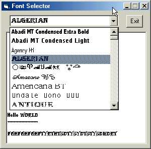



## Font selector \(office 2000\)

### Description

Disply Office 2000 fonts.

Ability to preview the fonts before you choose.

The fonts are sorted from A to Z

Improved Version!!!!!!!!!!!!!

DO VOTE!!!!!!!!!!!!!!!!!!!!!!!!!!!!!!!!!!!!!

DO VOTE!!!!!!!!!!!!!!!!!!!!!!!!!!!!!!!!!!!!!
 
### More Info
 

             |
---                |---
**Submitted On**   |2001-09-03 19:49:46
**By**             |[Ming Han](https://github.com/Planet-Source-Code/PSCIndex/blob/master/ByAuthor/ming-han.md)
**Level**          |Intermediate
**User Rating**    |4.6 (23 globes from 5 users)
**Compatibility**  |VB 5\.0, VB 6\.0
**Category**       |[Custom Controls/ Forms/  Menus](https://github.com/Planet-Source-Code/PSCIndex/blob/master/ByCategory/custom-controls-forms-menus__1-4.md)
**World**          |[Visual Basic](https://github.com/Planet-Source-Code/PSCIndex/blob/master/ByWorld/visual-basic.md)
**Archive File**   |[Font selec25887942001\.zip](https://github.com/Planet-Source-Code/ming-han-font-selector-office-2000__1-26932/archive/master.zip)

